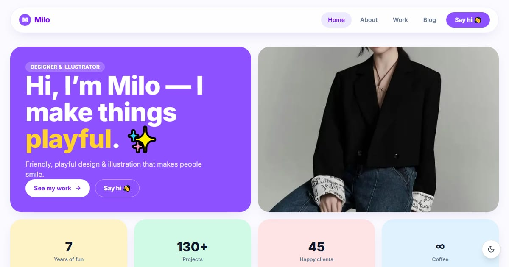

# Milo — Designer & Illustrator

Portfolio of Milo: playful, friendly product design & illustration that make digital products delightful.

**Demo live:** https://portfolio-milo.vercel.app



> Template portfolio dengan persona fiktif. Formulir kontak hanya demo.

## Konsep

Persona Milo, designer dan ilustrator. Bento yang ceria dengan ubin pastel dan judul Fredoka.

Multi-halaman (Home, About, Work, Blog, Contact) dengan mode gelap/terang lewat next-themes.

## Halaman

`/` · `/about` · `/blog` · `/contact` · `/work`

## Teknologi

- Next.js 15.5 (App Router) dan React 19
- Tailwind CSS v4
- JavaScript
- Framer Motion, Lucide (ikon), next-themes (mode gelap)
- Font: Inter, Fredoka (next/font)
- SEO: metadata per halaman, Open Graph, JSON-LD, sitemap.xml, dan robots.txt

## Menjalankan secara lokal

```bash
npm install
npm run dev
```

Buka http://localhost:3000. Untuk build produksi: `npm run build` lalu `npm start`.

---

Bagian dari koleksi 7 template portfolio personal di [PortalPorto](https://portal-porto-neon.vercel.app). Dibuat oleh [PintuWeb](https://pintuweb.com), jasa pembuatan website.
